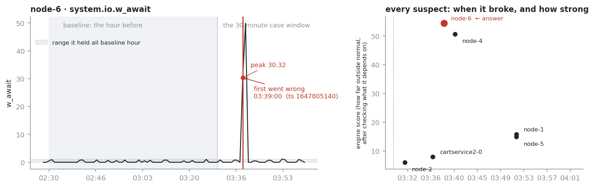
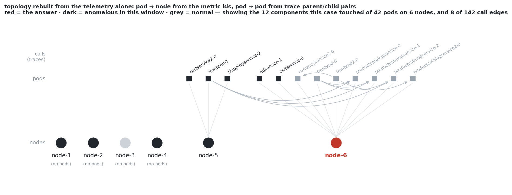

# ORIGIN — Track 1 — Root Cause Analysis

> **MantisGrid AI Hackathon, 17 September 2026 · Track 1 — Root Cause Analysis**
> An RCA agent whose evidence cannot lie, and which only pays for reasoning when the data is ambiguous.

Most agents dump telemetry into a model and ask what broke. ORIGIN reads only the failure window,
rebuilds who-runs-on-what and who-calls-whom from the telemetry itself, and lets a deterministic
engine rank the legal suspects. It spends model tokens only when the evidence is ambiguous: a cheap
GLM first, a strong one only when they disagree. Every number in its explanation is copied from the
raw data with the file and timestamp, so an on-call engineer can check it in seconds. It always
guesses, and says plainly how sure it is.

<!-- P2: drop the headline numbers in once the holdout run lands. Keep them holdout, not dev-tune. -->
Scores come in two flavours and we always say which: **partial** = the fraction of a case's scoring
points (one per asked field per failure); **strict** = cases where every point was right. For
reference, `docs/scoring.md` puts the published state of the art at **11.34% strict / 17.31%
partial** — measured on all 335 OpenRCA cases across three systems, so **not like-for-like** with our
49-case Market split.

**Headline results (holdout, 21 unseen cases):** _TODO P2_ — routed `<score> (± <sd>)` ·
single-model `<score>` · engine-only `<score>` · starter heuristic `<score>`, at `$<x>/case` and
`<y>s/case`. Full write-up and the negative results in [REPORT.md](REPORT.md).

## How it works

```
0 parse the case   window (UTC+8), how many failures, which fields are asked
1 load the window  only [window start - 60 min, window end], out of 12 GB of CSV
2 signals          which series and trace edges left their normal range, and when
3 candidates       rank the legal suspects, causal filter, legal reasons, render facts
4 route            gate (no model) -> GLM-4.7-Flash -> GLM-5.2 only on escalation
5 validate         legal component, legal reason, exact count, time from the data
6 render           predictions.csv + evidence/<row_id>.md
```

Three ideas, each measurable:

1. **The LLM chooses; the engine adjudicates.** Models pick among structurally legal candidates by
   fact ID. They never write a timestamp, a number, a component name outside the data, or a reason
   outside the 15 legal ones. The validator enforces that and falls back to the engine's answer.
2. **Evidence is rendered from data, not written by a model.** Every fact carries its file,
   `cmdb_id`, KPI and epoch timestamp; raw values are cut rather than rounded so a `grep` still
   matches. Any number in model prose that is not in the fact sheet removes that prose.
3. **A confidence gate.** When the engine's margin is large, no model is called at all — 4 of 20
   cases in our Docker run. Otherwise Flash decides, and GLM-5.2 only on disagreement, low margin,
   several failures or a hard task.

The model never sees raw telemetry — only a fact sheet of ≤ 40 facts (~4–6 K tokens), against the
474 K input tokens a "typical case" would cost by reading the window
([docs/models.md](docs/models.md)).





## How to run

```sh
pip install -r requirements.txt          # pandas, numpy, openai
make data                                # downloads Market-cloudbed-1 into data/ (1.3 GB -> ~12 GB)
export FEATHERLESS_API_KEY=...           # nothing in this repo reads .env for you:
                                         #   set -a; . ./.env; set +a   also works
make validate                            # our agent on 2 cases + output-shape check
make dev && make score                   # all 70 dev cases, then score them (make dev N=20 for 20)
make cost OUT=out/dev                    # dollars per case and per model
make docker                              # exactly as the judges run it: 2 CPU / 8 GB, 2 cases
```

Evals and one case at a time:

```sh
python -m eval.run_eval --config routed --split holdout --repeat 3
python -m eval.run_eval --config engine --split dev_tune          # free, no model calls
python -m origin.engine --row 38                                  # candidates, facts, ruled out
python scripts/make_figures.py --row 38                            # regenerate docs/figures/*.png
```

## What's in here

| Path | What |
|---|---|
| `agents/origin.py` | the submitted agent: budget, gate, router, validator, confidence, evidence |
| `origin/` | `case` `timeslice` `load` `anomaly` `signals` `candidates` `facts` `engine` · `router` `validate` `evidence` |
| `eval/` | `split.py`, the committed split, `run_eval.py`, `summarize.py`, results |
| `REPORT.md` | the eval write-up: routed vs single model, taxonomy, calibration, tuning log |
| `docs/engine-tuning.md` | every parameter change, with the dev-tune number before and after |
| `docs/data-notes.md` | the dataset's traps, measured on the real files |
| `docs/walkthrough.md` | how each half works, in plain language |
| `run.py` `llm.py` `cost.py` `score.py` `Dockerfile` `Makefile` | MantisGrid's starter (see Attribution) |

## Evaluation, briefly

70 dev cases split **49 dev-tune / 21 holdout**, stratified 3 per task type, fixed by `row_id` in
`eval/splits/split.json` before any run (rule: `md5(row_id)` order — deterministic, reproducible).
**Nothing was tuned on the holdout**: every parameter change came from dev-tune results and is logged
in `docs/engine-tuning.md`. Configurations compared: `routed` (submitted), `single-flash`,
`single-strong`, `engine` (no model calls), and the starter `heuristic` floor.
<!-- P2: mention repeats + variance here, and the abstention/calibration framing scoring.md asks for -->

## AI disclosure

Using AI heavily is expected here; not disclosing it is the problem
([Agreement §5](docs/PARTICIPANT_AGREEMENT.md)). The full log, per module, is
[`docs/ai-use.md`](docs/ai-use.md).

**Models inside the product.** Only the **GLM family on Featherless**, chosen per call:
`GLM-4.7-Flash` (fallback `GLM-5.3-Flash`) for the routine pick over the engine's candidate list,
`GLM-5.2` (fallback `GLM-5.1`) only on escalation, and **no model at all** on cases the confidence
gate settles — 4 of 20 in our Docker run. Thinking is off on every call, measured (see
`docs/model-findings.md`). No other network access at judged runtime.

**Agent frameworks.** None. Plain Python on the OpenAI SDK through the starter's `llm.py` wrapper.
No LangChain, no agent framework, no tool-calling loop. Runtime dependencies are `pandas`, `numpy`,
`openai`.

**How this project was built.** *Ideation was human*, with AI as a sounding board: the problem
framing, the architecture (a deterministic engine that adjudicates, with models choosing among
legal candidates), the priorities and the cut order were the team's decisions, written up in
`SPEC.md` and `PLAN.md` before any code. *Execution was with coding agents* — **Claude Code
(Claude Opus 5)**, used by both team members, wrote most of the code in this repository from those
specs, under human direction and review.

What that means honestly, module by module (details in `docs/ai-use.md`):

- **AI-generated from our specs, human-reviewed:** `origin/` (loader, signals, candidates, facts,
  engine, anomaly, router, validate, evidence), `agents/origin.py`, `eval/`, the figures script,
  and the documents in `docs/` that we wrote ourselves.
- **Team-written:** the shared contract and parameter values (`origin/contract.py`,
  `origin/config.py`, typed from the plan), and every decision about *what* to build, *what to cut*,
  and *which measurements to trust*.
- **Not ours:** the starter files listed under Attribution.
- **Derived from data rather than written by anyone:** the engine rules that differ from the plan —
  the two anomaly guards, service-level candidates, the node-is-a-symptom rule, the magnitude rules,
  damage-vs-delay, the onset shift. Each came from reading real output on the dev-tune split and each
  is logged with its before/after number in [`docs/engine-tuning.md`](docs/engine-tuning.md), with
  per-method sources in [`docs/engine-provenance.md`](docs/engine-provenance.md).

Every AI-generated line was read by a human before commit. The team is responsible for all of it.
## Attribution, and the one starter file we changed

Starter files (`run.py`, `score.py`, `cost.py`, `llm.py`, `agents/heuristic.py`,
`agents/routed.py`, `Dockerfile`, `Makefile`) are MantisGrid's — see
[`LICENSE-MANTISGRID`](LICENSE-MANTISGRID). `score.py` vendors OpenRCA's own
evaluator **unchanged**. Telemetry is OpenRCA-derived, CC BY-NC 4.0, and is **not
included** in this repository — see [`ATTRIBUTION.md`](ATTRIBUTION.md).

Two edits to the starter, both disclosed:

1. **`run.py`** — its default `--agent` is now `agents.origin`. The command line
   is otherwise untouched.
2. **`llm.py`** — `_once()` now falls back to `message.reasoning` when
   `message.content` is blank. Featherless returns the answer there on **both
   Flash models** (measured 4/4 calls, [`docs/model-findings.md`](docs/model-findings.md) §3),
   so the unpatched client returns `""` on **every `GLM-4.7-Flash` call while
   still being billed**. The patch sits after the token accounting and changes
   only which field the text is read from — counts, prices, retries and the
   circuit breaker are byte-identical, so it cannot flatter our cost numbers.
   Anyone using the starter `llm.py` with a Flash model is silently getting empty
   answers.
