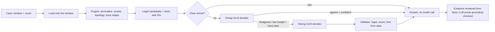
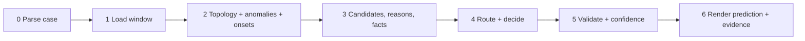

# ORIGIN — spec (v6.0)

Sep 17, 2026 · MantisGrid AI Hackathon · **Track 1 — Infrastructure Root Cause Analysis**
Two people · Build 10:00 · Freeze 2:15 · Record 2:15–2:40 · Submit by 2:50 (form closes **3:00pm PDT**)

v6.0 rewrites v5.3 around what we were handed at check-in. v5.3 was written blind
(generic OTel/DCGM telemetry, a Claude agent, a 2-minute video, a Streamlit UI).
The real task is OpenRCA's Market dataset, GLM models on Featherless chosen per call,
a headless Docker submission scored on accuracy, evidence, eval quality and cost, and
a ~4-minute presentation. See "What changed from v5.3".

The official material is in this repo: `docs/BRIEF.md`, `docs/data.md`,
`docs/models.md`, `docs/scoring.md`, `docs/submission.md`, `docs/STARTER_README.md`,
`docs/PARTICIPANT_AGREEMENT.md`. **Where this spec and those disagree, those win.**

---

## Priorities (read this if the day is on fire)

Seven things must exist at 2:50. Everything else can burn.

1. **A valid, judgeable submission** — Dockerfile at the repo root, `run.py` command line unchanged, our agent as `run.py`'s default `--agent`, exactly `n` failure objects per case with keys in order, one `evidence/<row_id>.md` per case, `make validate` and `make docker` pass (2 CPU / 8 GB). _An unjudgeable submission scores zero on everything._
2. **Fast, correct window loading** — only the case's window plus a baseline is read, with UTC+8 and seconds-vs-milliseconds handled. Well under a minute per case on 2 CPUs.
3. **Deterministic candidate engine** — robust z with an IQR floor and onset over metrics, **trace parent→child latency for network faults**, topology from names (node → pod → service) and trace calls, a causal filter, legal reasons per level.
4. **Grounded evidence for every case** — `## Answer`, `## Confidence`, `## Evidence`, `## Ruled out`, where every number and timestamp is copied from the raw rows with file, `cmdb_id`, KPI and epoch time, so a judge can grep it. _Evidence is 35% of the grade against accuracy's 20%, and evidence not in the data scores zero._
5. **Routing across the GLM family** — engine first, cheap model when needed, strong model only on escalation, with a fallback model for each tier and a per-case time guard.
6. **The eval** — routed vs single-model (at minimum), plus engine-only and the starter heuristic, on a held-out split: accuracy (mean, strict, per task type), $/case, s/case, variance across repeats, a failure taxonomy, and accuracy by confidence level. Written up in `REPORT.md` with `eval/` committed.
7. **A ~4-minute presentation** showing it working: one case run live, its evidence file opened and one number grepped from the raw CSV, then the routed vs single-model table.

**Always emit a best guess** in the prediction; put doubt in the evidence. Blank and wrong both score zero.

**If nothing works:** the starter heuristic with our window loader, UTC+8 fix, grounded evidence renderer and eval table (heuristic vs starter routed vs single model). Say so in REPORT.md.

---

## Innovation spine

ORIGIN is an **RCA agent whose evidence cannot lie, and which only pays for reasoning when the data is ambiguous.**



Three ideas, each measurable:

1. **The LLM chooses; the engine adjudicates.** Models pick among structurally legal candidates by fact ID. They never write a timestamp, a number, a component name outside the data, or a reason outside the legal list. The validator enforces all of that and falls back to the engine's answer.
2. **Evidence is rendered from data, not written by a model.** Every fact carries its file, `cmdb_id`, KPI and epoch timestamp. Any number in model prose that isn't in the fact sheet removes that prose. This is our direct answer to "evidence that isn't in the data scores zero".
3. **Escalation routing with a confidence gate.** When the engine's margin is large, no model is called. Otherwise a cheap Flash model decides first, and GLM-5.2 is called only on disagreement, low margin, multiple failures, or a hard task. We report what the gate and each tier buy in accuracy, dollars and seconds.

**"It won't fit in context. Query it." (brief + slide).** The engine *is* the query layer. It reads only the window, from files far larger than memory. The model never receives raw telemetry, only a fact sheet of ≤ 40 facts (~4–6K tokens) against a "typical case" of 474K input tokens in `docs/models.md`. That token gap is a headline number for the eval. Letting the strong model ask for more data through bounded query tools (`get_series`, `get_edge`, each result registered as a new fact ID so it stays grounded) is **STRETCH #2**. It reuses the query backend that STRETCH #1 (our MCP server) builds first.

**Precedent to cite.** A 2026 trajectory study of 3,500 RCA agent runs proposed DiagGuard: survey the evidence before localizing, audit the diagnosis against it afterward. It raised top-1 from 43.5% to 52.5% held-out. ORIGIN's engine-first survey and deterministic validator are the same idea.

**Not our pitch:** "we beat SOTA" (we will say honestly where we land), autonomous remediation, a dashboard, model shopping outside GLM.

---

## Pitch

**Written (README / form):** Most agents dump telemetry into a model and ask what broke. ORIGIN reads only the failure window, rebuilds who-runs-on-what and who-calls-whom from the telemetry, and lets a deterministic engine rank the legal suspects. It spends model tokens only when the evidence is ambiguous: a cheap GLM first, a strong one only when they disagree. Every number in its explanation is copied from the raw data with the file and timestamp, so an on-call engineer can check it in seconds. It always guesses, and says plainly how sure it is.

**Spoken (presentation):** "We don't let the model make up evidence. We let it choose between suspects the data already supports, and only pay for the big model when the small one isn't sure."

**Honesty lines (use them):** "The best published agent solves 18 of 70." "A reasoned negative result beats a vague claim." If the strong model buys nothing over Flash, that is our headline finding, and we show it.

| Don't say | Say |
| --- | --- |
| robust z-score with an IQR floor | how far outside its normal range a metric went |
| onset | when it first went wrong |
| causal filter | a component is a suspect only if what it depends on looked normal first |
| escalation routing | the small model answers first; the big one only when needed |
| grounding check | every number is copied from the raw data |

---

## What changed from v5.3

| Change | Why |
| --- | --- |
| Task is OpenRCA **Market-cloudbed-1**: 70 dev cases with answers; judged on **20 unseen cases from another deployment** of the same shop | `docs/data.md`, `docs/scoring.md` |
| Output is `predictions.csv` (datetime / component / reason, exact strings, exact count, key order) + `evidence/<row_id>.md` | `docs/submission.md`; the evaluator is a regex |
| **LLM is the GLM family on Featherless** (OpenAI-compatible), not Claude; the model is **chosen per call** | Track rule, `docs/models.md` |
| Headless Docker submission (2 CPU, 8 GB, no network but the model endpoint), **1 min/case average (20 min for 20 cases)**, $25 per run | `docs/submission.md`, `docs/models.md` limits; time is the one most likely to bind |
| Streamlit app, plotly graph animation and 2:00 video **removed**; ~4-minute presentation of the headless agent running | "There's no interface dimension" (`docs/scoring.md`); the form asks for ~4 min |
| Evidence is the core output (35% vs accuracy 20%) and must be **checkable against raw files** | `docs/STARTER_README.md`, `docs/submission.md` |
| **Fix test (ridge counterfactual) demoted to STRETCH**; the verifier becomes a legality validator + grounding check | Simulated numbers aren't "in the data" and could score zero as evidence; 1 min/case leaves no room; accuracy is only 20% |
| Graph kept but narrowed: topology from names (`node-5.adservice-2`) + trace call edges, used for the causal filter and network faults | "The topology is in the names"; "network faults only show in traces" |
| Eval must compare **routed vs single model**, with variance over repeats, $/case and s/case | `docs/scoring.md` "Your eval" |
| Confidence is **scored for calibration** | `docs/scoring.md` |
| Fixed parameters stay fixed, but now tuned on a **dev-tune split only**; a stratified **holdout** of 21 cases is untouched until the final eval | We have all 70 answers; judges score another deployment |
| Clock re-timed from the real start (~9:45 plan read) and the 3:00pm form deadline | Check-in |

---

## Stretch goals

Build only after Checkpoint 4 passes (see PLAN).

| Stretch | Note |
| --- | --- |
| **#1 ORIGIN MCP server** (`mcp_server.py`, FastMCP over stdio): tools `list_cases`, `analyze_case`, `get_candidates`, `get_evidence`, `get_series`, `get_edge`, so an SRE can ask Claude Desktop / Claude Code "what broke between 09:00 and 09:30?" and get the same grounded facts | Answers slide item 02 with our own MCP (MantisGrid's MCP is Track 2's GPU-cost API). ~45–60 min. **Outside the judged path:** not in the Dockerfile or `requirements.txt`, run with `uv run --with fastmcp`. One 20–30 s presentation beat |
| **#2 Bounded query tools for the strong model** (`get_series(component, kpi)`, `get_edge(caller, callee)`, ≤ 2 calls, results become new fact IDs) | Makes "the model queries the telemetry" literal; only on escalated cases; watch the 45 s deadline |
| Fix test: ridge counterfactual on metric KPIs as an extra **"Verifier check (simulated)"** line in Ruled out, clearly labelled | Only on pods with enough baseline; never in `## Evidence` |
| Log template mining (error burst per pod) as a signal | Cheap signal for process termination |
| `metric_mesh` edge metrics as a second network signal | Watch the quoted kpi_name with commas |
| Topology / candidate PNG in the evidence folder for the presentation | Not scored |
| Thinking-on vs thinking-off ablation on GLM-5.2 | Clean dial per `docs/models.md` |
| Prompt-prefix caching measurement | `docs/scoring.md` mentions caching of repeated scaffolding |

---

## Track context that shapes the build

**The brief:** "Build an agent that works out, from the telemetry alone, when each failure started, which component caused it, and why." Build three things: **the agent**, **the eval** (at minimum routed vs single model), **the explanation** (scored whether or not the answer is right, and worth more than accuracy).

**Slide (Track 1):** Create: an agent that names the time, component and cause · evidence for every answer · your own benchmarks: routed vs one model. Given: 12 GB of real telemetry · 70 cases, answers included · a starter pack that already runs end to end · 7 GLM models on a provided Featherless key. Excel: **It won't fit in context. Query it** · **Route various models to save tokens** · **Be honest: the best published agent solves 18 of 70** · **A reasoned negative result beats a vague claim**. Focus: [accuracy] and explainability.

**Slide (What are we looking for):** 01 solves a real problem · 02 use MantisGrid AI MCP to build chat/agentic experiences · 03 makes intelligent decisions · 04 automates something humans struggle to do at scale · 05 produces a measurable outcome · 06 can be demonstrated today. **Golden rule: Working > Perfect.** Ship real functionality · demo with conviction.

- **MCP (item 02):** MantisGrid's MCP (`track-2/mcp_layer/` in the official repo) serves Track 2's GPU-cost API, not our telemetry. The Track 1 container can only reach the model endpoint, and "use of MantisGrid AI/MCP" is a Track 2 judging focus (Agreement §8). So **the judged agent uses no MCP**. Instead **STRETCH #1** wraps ORIGIN's engine in **our own MCP server**, a chat/agentic experience for an on-call engineer, kept outside the Docker path. **Ask an organizer at CP1** whether Track 1 expects MCP; if they say it's required, it moves up to right after Checkpoint 3.
- **"Makes intelligent decisions"** → the routing gate and the causal filter, each shown with numbers.
- **"Automates something humans struggle at scale"** → 12 GB, 40 pods, 9 M spans a day; an SRE can't read that at 3am.
- **"Measurable outcome"** → the eval table.

**Judging weights (Participant Agreement §8):** Technical Execution 40% · Innovation / Wow 30% · Potential Impact 20% · Presentation / Demo 10%. Track 1 focus within those: **model accuracy, explainability, strength of evaluations, token usage**. `docs/STARTER_README.md`: evidence is **35%** against accuracy's **20%**. Ties go to evidence, then to how honestly uncertainty is stated.

**Judges:** Sanyogita Shamsunder · Raghu Madabushi · Yuan Li (professor) · Vince Kohli (empathy scholar).
- For a professor: eval rigour. Held-out split, repeats and variance, a stated negative result, no tuning on the holdout.
- For an empathy scholar: the on-call human. Evidence you can check in seconds, honest confidence, "what I ruled out and why", no false certainty at 3am.
- Both people should be ready to explain every part (Agreement §5: inability to explain your own code hurts Technical Execution).

**How they run us (`docs/submission.md`):**

```bash
docker build -t your-team .
docker run --rm -e FEATHERLESS_API_KEY=<their key> -v <bundle>:/data:ro -v <empty>:/out \
  your-team python run.py --dataset /data --queries /data/query.csv --out /out
```

They run it **more than once, under undisclosed conditions**, on a deployment whose component names differ. **Never hardcode component names or anything learned from the dev answers.**

---

## Operating constraints

- **Limits (enforced outside us):** $3 and 10 min per case; **$25 and 20 min for the 20-case run**. Our own guards sit well below: **45 s soft deadline per case**, and engine-only for the rest of the run if the average climbs past 50 s.
- **Machine:** 2 CPUs, 8 GB, no GPU. Peak memory target < 3 GB. Test with `make docker` (it passes `--cpus 2 --memory 8g`).
- **Network:** only `FEATHERLESS_BASE_URL`. No downloads or package installs at runtime.
- **Reads only `--dataset`, writes only `--out`.** Keep `run.py`'s command line; change the agent.
- **Keys:** `FEATHERLESS_API_KEY` from the environment; `.env` is gitignored and never in the Docker build context. Keys are per-team and revoked after the event.
- **Data is never committed** (CC BY-NC 4.0, 12 GB). `data/` is in `.gitignore` and `.dockerignore`.
- **Fresh work:** starter code is MantisGrid's (`LICENSE-MANTISGRID`) and fair game; everything else is written today. README lists AI models, coding assistants, agent frameworks, and what was AI-generated vs team-written.
- **Feature freeze 2:15.** After 3:00: bug fixes and deploy repairs only.
- **English.** One project, one track: "Track 1 — Root Cause Analysis".
- **Budget:** $25 of Featherless credit per person. Develop on Flash; measure the big models on the holdout only.

---

## Check-in facts (replaces v5.3's nine questions)

| v5.3 question | Answer |
| --- | --- |
| Parent span IDs? | Yes: `trace_span.csv` has `span_id, trace_id, parent_span`. **Rung 1 (spans)** is available. |
| Normal data before each incident? | Each telemetry day is complete; the case window is 30 min. **Baseline = the 60 min before the window** (fallback: the 60 min after). |
| Metric labels? | No labels. `metric_container.cmdb_id = "<node>.<pod>"`; `metric_node.cmdb_id = "node-N"`; `metric_mesh.cmdb_id = "<pod>.<source|destination>.<svc>.<svc>"` (two components); `metric_service` keyed by `service`. |
| Entity IDs unique across clusters? | One deployment per bundle (cloudbed-1). The judged bundle is another deployment with different component names. |
| Label granularity? | Answer components are exact data names: pods (`shippingservice-1`), nodes (`node-5`), and possibly services. **P1 tabulates which forms appear in dev answers.** |
| Shape? | 70 cases, 2 days (2022-03-20/21), 30-min windows with a stated failure count, 7 task types (which of time / component / reason are asked). Files in `docs/data.md`. |
| Held-out? | Yes: 20 unseen cases, another deployment, run by the organizers. |
| Judging focus? | Accuracy, explainability, evals, token usage. Evidence 35%, accuracy 20%. |
| Keys after submission? | Revoked after the event; judges use their own key. |

**Traps to handle in code (from `docs/data.md`):** metrics and logs in **seconds**, traces in **milliseconds** · every answer time is **UTC+8** with a **60 s tolerance** · no sample at the exact fault time · **network faults show mainly in traces** (~⅓ of reasons) · some windows have **several failures** (report in time order, exact count) · `trace_span.csv` 1.3 GB/day and `log_proxy.csv` 2.9 GB/day (never full-read) · `metric_mesh.kpi_name` is quoted and contains commas (use a CSV parser) · `trace_span.type` / `status_code` aren't uniform · parse `query.csv` with a CSV reader.

**The 15 legal reasons.** Node-level: `node CPU load`, `node CPU spike`, `node disk read I/O consumption`, `node disk space consumption`, `node disk write I/O consumption`, `node memory consumption`. Container-level: `container CPU load`, `container memory load`, `container network latency`, `container network packet corruption`, `container network packet retransmission`, `container packet loss`, `container process termination`, `container read I/O load`, `container write I/O load`.

---

## Pipeline

Stages 0–3 are deterministic Python (pandas, numpy). Models appear only in stage 4.



### Fixed parameters (set before tuning; changed only on dev-tune, logged)

| Parameter | Value | Meaning |
| --- | --- | --- |
| τ | 3.0 | Robust z threshold (IQR-floor units) |
| k | 2 | Consecutive breaching samples for onset (metrics are ~60 s apart) |
| IQR floor | max(IQR, 0.05·\|median\|, smallest nonzero step, 1e-9) | No divide-by-zero |
| z cap | 50 | One metric can't dominate |
| Baseline | 60 min before window start (fallback 60 min after end) | Where "normal" comes from |
| Trace bucket | 30 s | Edge-latency time resolution |
| Candidates shown to a model | 8 | Prompt size and time |
| Gate: engine answers alone | margin ≥ 0.35 and support ≥ 2 and n_failures = 1 | Early stop |
| Escalate to strong | cheap pick ≠ engine top-1, or margin < 0.15, or n_failures ≥ 2, or task asks all three fields, or cheap output invalid | Pay for reasoning only when ambiguous |
| Soft deadline | 45 s per case; skip strong if < 20 s left | Run limit is 60 s/case average |

**Tuning rule.** Parameters and the KPI→reason table may change **only from dev-tune results** (49 cases). The holdout (21 cases, stratified 3 per task type, chosen by row_id before any run) is run once per configuration for the final table. Every change is logged in `REPORT.md`.

### 0. Parse the case — no LLM · P1
Regex the window (month name, day, year, `HH:MM` to `HH:MM`, a possible second date), **interpret it as UTC+8**, convert to epoch seconds. Parse the failure count (words and digits: "one failure", "two failures", "3 failures"). Parse which fields are asked (datetime / component / reason) from the instruction wording; the task types are in `docs/data.md`. A cheap-model cross-check runs **only if the regex fails**.

### 1. Load the window — no LLM · P1
- Read `[window start − 60 min, window end]` only (plus the 60 min after if the baseline is short). Byte-offset binary search on time-sorted CSVs; chunked filtering as a fallback; per-day in-process cache for small files.
- Sources, in priority order: `metric_container`, `metric_node`, `trace_span`, `metric_service`, `log_service`. `metric_mesh`, `metric_runtime` and `log_proxy` are STRETCH.
- Normalize: `ts` in epoch **seconds** everywhere (divide trace timestamps by 1000 once, at load); component names exactly as in the data; `level` in {node, pod, service}.
- Topology from names: `node-5.adservice-2` → pod `adservice-2` runs on `node-5`; pod → service by stripping the trailing `-<digits>`.
- Trace edges: join each span to its `parent_span` in the same trace; when the pods differ, record the call `(caller = parent pod, callee = child pod, ts, gap_ms = parent.duration − child.duration, child_ms, error)`.

### 2. Anomalies and onsets — no LLM · P2 writes `score_series`, P1 applies it
- Per (component, KPI) series and per trace edge (`gap_ms` median per 30 s bucket): robust z against the baseline, capped at 50. Score = highest z sustained for k consecutive samples; onset = first sample of the first sustained breach.
- **Zero-baseline rule:** if baseline median and IQR are both 0, anomalous when nonzero for k samples; score = τ + 10 × breach fraction, capped at 50.
- **Disappearance rule** (process termination): a series with ≥ 10 baseline samples and none for ≥ 2 expected intervals inside the window is anomalous, onset = last seen + one interval.

### 3. Candidates, reasons, facts — no LLM · P1
- **Candidate score** = top sustained z + 2·log(1 + support), where support is the number of distinct anomalous KPIs or edges.
- **Causal filter:** demote (×0.3) a component when something it depends on went anomalous earlier (> 60 s): its node (pod on anomalous node), or a callee pod on an anomalous edge. A node with ≥ 2 anomalous pods whose onsets are within 120 s of the node's own is promoted over those pods. A callee shared by ≥ 2 anomalous edges is the network suspect.
- **Reasons:** a fixed KPI-pattern → reason table per level. Each anomalous signal adds its z × weight to that reason; network signals come from trace edges; process termination from disappearance. Only legal reasons for the level. `node CPU spike` vs `node CPU load` by breach duration (≤ 3 samples = spike).
- **Facts:** each anomalous signal becomes a fact with an ID (`F1…`), source file, `cmdb_id`, KPI or edge, baseline median (n samples, range), window peak with its raw value and epoch timestamp, onset and z. Ruled-out sentences for the next candidates come from the same facts.
- **Engine answer:** top-n candidates by score (n = failure count; for n ≥ 2 prefer candidates with separated onsets, > 5 min apart), each with its top reason and onset as the time, in chronological order.

### 4. Route and decide — GLM · P2
- **Gate** (no model): if the gate condition holds, the engine answer stands.
- **Cheap** (`GLM-4.7-Flash`, fallback `GLM-5.3-Flash`, thinking off): given the fact sheet (≤ 8 candidates, ≤ 40 facts, the legal reasons per level, n), reply JSON `{"answers":[{"component","reason","fact_ids"}],"confidence","why"}`.
- **Strong** (`GLM-5.2`, fallback `GLM-5.1`, thinking on) on the escalation conditions, with the same prompt plus the cheap pick and the engine's top-1.
- **Single-model configurations** for the eval: the same flow with every model call on one model, and no gate.
- Every call goes through the starter's `llm.LLM.ask()` (retries, fallback, breaker). A failure falls back to the engine answer and says so in the evidence.

### 5. Validate and set confidence — no LLM · P2
- The component must be a candidate or a known component; the reason must be legal for its level (else the candidate's top engine reason); exactly n answers (pad from the engine ranking, trim extras); time = the engine onset for the chosen component and reason signal, never model-written; chronological order.
- **Confidence (fixed rule, reported for calibration):** High = margin ≥ 0.35, support ≥ 2, and any model called agreed with engine top-1. Low = margin < 0.15, or the model overrode the engine, or any fallback / error / deadline skip. Otherwise Medium.

### 6. Render — no LLM · P1 facts, P2 assembly
- `predictions.csv` via `run.format_prediction()`, including only the asked fields.
- `evidence/<row_id>.md`: `## Answer`, `## Confidence` (level + why), `## Evidence` (rendered facts for the chosen component(s)), `## Ruled out` (next 3 candidates with the fact-based sentence), `## How this was produced` (route taken, models, calls, tokens, seconds).
- **Grounding check:** any number in model-written prose must appear in the fact sheet (small counts ≤ 10 exempt), and any component-like token must be a real component; otherwise the prose is dropped and the template sentence is used, with a note.

---

## Evidence format (the part worth most)

Example of the target (numbers illustrative):

```markdown
## Answer
shippingservice-1 / container read I/O load / 2022-03-20 09:09:00

## Confidence
Medium. The engine and GLM-4.7-Flash agreed, but emailservice-0 moved within 2 minutes.

## Evidence
- F3 · metric_container.csv · node-5.shippingservice-1 · container_fs_reads_MB./dev/vda — baseline median 2.1 (60 samples, 08:00–09:00 UTC+8); first outside normal at 2022-03-20 09:09:00 (ts 1647738540), value 47.02; peak 51.3 at 09:12:00 (ts 1647738720); 18.3× its normal range.
- F7 · trace_span.csv · frontend-0 → shippingservice-1 — call gap median 3.1 ms in baseline, 41.0 ms in the 09:09:00–09:09:30 bucket.

## Ruled out
- emailservice-0 — its first anomaly (F9, 09:11:00) comes 2 minutes after shippingservice-1's.
- node-5 — node CPU, memory and disk were inside normal (no node facts), so the node layer isn't the cause.

## How this was produced
Engine margin 0.22 → GLM-4.7-Flash (1 call, 3,812 in / 164 out) agreed → no escalation. 14.2 s total.
```

---

## Eval — `eval/` + `REPORT.md` · P2

| Config | What it is |
| --- | --- |
| `heuristic` | Starter baseline (`agents.heuristic`), for the floor (0.073 published) |
| `starter-routed` | Starter's routed example: shows what the plumbing alone buys |
| `engine` | ORIGIN with no model calls |
| `single-flash` | ORIGIN, every call on `GLM-4.7-Flash`, no gate |
| `single-strong` | ORIGIN, every call on `GLM-5.2`, no gate |
| **`routed`** | **ORIGIN submission config**: gate → Flash → escalate to GLM-5.2 |

Reported per config on **holdout (21)** and **dev-tune (49)**, never mixed: mean score, fully solved k/n, per difficulty and per task type, time-only / component-only / reason-only accuracy, **$/case** (from `cost.py`), **$/correct**, **s/case** (mean, max), and **std across 3 repeats** for `routed`, `single-strong` and `single-flash` on the holdout. Also:

- **Routing breakdown:** % of cases answered by the gate / Flash / escalated; accuracy of each path.
- **Failure taxonomy:** wrong count, wrong time only, wrong component (node vs pod confusion, symptom picked over cause), wrong reason (network group confusion, CPU load vs spike), timeouts and fallbacks.
- **Calibration:** accuracy by confidence level (High / Medium / Low), with the counts.
- **Negative results** stated as findings (e.g. "GLM-5.2 bought +0.0x for 9× the cost").
- The gap caveat: dev numbers are an estimate; the judged deployment differs.

---

## Presentation (~4 min) · both

| Time | Beat | Priority |
| --- | --- | --- |
| 0:00–0:25 | The problem: a fault spreads and everything looks broken; the honest bar (best published agent: 18 of 70) | MUST |
| 0:25–1:20 | **Run one case live** (`python run.py ... --limit 1` on a chosen dev case, or `make docker`), narrating the pipeline while it runs | MUST |
| 1:20–2:20 | **Open the evidence file**: answer, confidence, facts; `grep` one fact's timestamp and KPI in the raw CSV on screen; read "Ruled out" | MUST, never cut |
| 2:20–3:30 | **Eval:** routed vs single-flash vs single-strong vs engine vs heuristic: accuracy, $/case, s/case, variance; routing breakdown; one honest negative result | MUST |
| 3:30–4:00 | Failure taxonomy + calibration in one sentence; what we'd do next | nice |
| (inside 3:30–4:00, only if STRETCH #1 shipped) | ~20 s: the same engine as an MCP tool — ask Claude "what broke between 09:00 and 09:30?" and show it calling `analyze_case` / `get_evidence` | STRETCH, cut first |

Record it (QuickTime / Cmd+Shift+5) as a backup even if presented live. Never show a fallback run as the agent deciding.

---

## Submission contract

- Repo root: `Dockerfile`, `run.py` (starter CLI unchanged; default `--agent agents.origin`), `REPORT.md`, `eval/`, `README.md`.
- `run.py` writes `predictions.csv`, `evidence/<row_id>.md`, `usage.jsonl`.
- Form: team + status, title + description with "Track 1 — Root Cause Analysis", public repo (default branch, latest commit is judged), ~4-min presentation.
- README: what it is, how to run (`make data`, `make dev`, `make score`, `make docker`), AI disclosure (models: GLM family via Featherless in the product; coding assistants used by each person; agent frameworks: none, plain OpenAI SDK), what was AI-generated vs team-written, starter attribution, data licence.

---

## Split

| Owner | Builds |
| --- | --- |
| **P1: data + engine** | Data download and trap verification · case parser (UTC+8) · fast window loader · normalization + topology + trace edges · applying anomaly scoring to metrics, edges and disappearance · candidates, causal filter, reasons · facts + fact rendering · engine answer · engine accuracy tuning on dev-tune |
| **P2: agent + routing + eval** | Featherless model spike (availability, latency, thinking toggle, JSON reliability) · holdout split · `score_series` · `agents/origin.py` (budget, gate, cheap/strong calls, validator, confidence, evidence assembly, grounding check) · eval harness and all runs · REPORT.md · README + AI disclosure · Docker check · presentation lead |

P2 builds the router against a **stub Analysis fixture** from 10:30, so only real engine output is missing at the 12:45 checkpoint.

---

## Clock

| Time | Plan |
| --- | --- |
| 9:45–10:00 | Both read SPEC + PLAN. P1 starts the data download immediately (`make data`, ~1.3 GB) |
| 10:00–10:30 | P1: push scaffold, verify traps on real files (UTC+8, ms vs s, sortedness, component forms in answers), case parser. P2: env, model spike, holdout split, baseline runs of the starter heuristic |
| 10:30 | 🛑 CP1: contract lock + trap findings + model findings |
| 10:30–11:30 | P1: window loader + normalization + topology + trace edges (⏱ 11:00 gate: load one case < 15 s). P2: `score_series`, stub fixture, `agents/origin.py` skeleton with gate / router / validator, eval harness |
| 11:30 | 🛑 CP2: real window loads; anomalies on real data; harness runs heuristic + starter-routed |
| 11:30–12:45 | P1: candidates, causal filter, reasons, facts, engine answer (lunch at the keyboard). P2: prompts, grounding check, confidence, evidence assembly on the stub; `run.py` default agent switched |
| 12:45 | 🛑 CP3: first end-to-end ORIGIN run on dev-tune with a score; `make validate` passes |
| 12:45–1:45 | P1: accuracy fixes from the failure taxonomy (dev-tune only), time per case. P2: all eval configs on the holdout + repeats, REPORT.md, `make docker` |
| 1:45 | 🛑 CP4: docker passes at 2 CPU / 8 GB, 20 cases < 20 min, final eval table |
| 1:45–2:15 | Mutual walkthrough (mandatory), README, REPORT polish, pick the demo case, dry-run the presentation |
| 2:15 | Feature freeze |
| 2:15–2:40 | Record the ~4-min presentation |
| 2:40–2:50 | Repo public, secrets check, submit the form. **Hard deadline 3:00pm PDT** |

---

## Cut order

**Already out:** Streamlit app, video graph animation, Claude API, ridge fix test (stretch), MantisGrid's Track 2 MCP, MCP inside the judged container (our own MCP server is STRETCH #1), `log_proxy`, peer z, PageRank, change-event vertices, open-ended multi-turn tool loops (the bounded query tools are STRETCH #2).

**Never cut:** valid submission · window loader with UTC+8 / ms fix · engine candidates · grounded evidence · routed vs single-model eval · presentation.

**If behind, cut in this order (first goes first):**
1. `log_service` signal
2. `metric_service` signal
3. Repeats beyond 2 (report n = 2 variance, say so)
4. `starter-routed` eval row
5. Model prose in evidence (template sentences only)
6. Causal filter's node promotion (keep the demotion)
7. `single-flash` row (keep `single-strong` vs `routed`, the required pair)
8. Trace edges (**costs ~⅓ of reasons**: say "blind to network faults" in REPORT)
9. The confidence gate (always call Flash)

---

## Emergency ladder

1. Keep going for engine + routing until 1:30.
2. Loader too slow → drop traces and logs, metrics only, and say so.
3. Engine worse than heuristic on dev-tune at 12:45 → submit the heuristic ranking with our loader, UTC+8 fix, grounded evidence and routed decision on top; report it honestly.
4. Models unavailable → engine-only answers, evidence says "no model reachable", eval reports what we have.
5. Docker fails at 1:45 → fix only that until it passes; nothing else matters more.

---

## Checklists

### Submission
- [ ] Form submitted by 2:50 (closes 3:00pm PDT)
- [ ] Title and description say "Track 1 — Root Cause Analysis"
- [ ] Both members listed, with student/career status
- [ ] Public repo, default branch has the final commit, no secrets, `.env` untracked, history checked
- [ ] Single Dockerfile, at the root; `make docker` passes
- [ ] `run.py` default agent is ours; CLI unchanged
- [ ] README: AI models / assistants / frameworks, AI-generated vs team-written, how to run, starter + data attribution
- [ ] REPORT.md: routed vs single model, holdout vs dev-tune, variance, failure taxonomy, calibration, negative results, tuning log
- [ ] `eval/` harness and results committed
- [ ] Presentation ~4 min: live case, evidence file with a grep, eval table
- [ ] English

### Morning-of (done / now)
- [x] Brief, data, models, scoring, submission docs read
- [x] Starter copied to the repo root
- [ ] Featherless keys in hand for both people
- [ ] Data downloaded on both laptops (or P2 uses P1's via a shared drive)
- [ ] Docker Desktop running on at least one laptop
- [ ] Both can explain: UTC+8 and ms/s traps, window loading, robust z and IQR floor, onset, topology from names, trace edge gap, causal filter, reason table, facts and the grounding check, gate and escalation, the eval split, calibration

---

## Success bar

**Ship (must):** valid Docker submission running 20 cases in < 20 min at 2 CPU / 8 GB · grounded evidence for every case · engine + routed decision · eval with routed vs single model on a holdout, $/case, s/case, variance · REPORT.md · ~4-min presentation with a live case.

**Stretch:** our own MCP server over the engine (#1), bounded query tools for the strong model (#2), fix-test verifier line, mesh / log signals, thinking ablation.

**Win path.** Technical Execution through correct loading on a hard dataset, a verifiable engine and a rigorous eval. Innovation through evidence that can't lie and escalation routing that measurably saves dollars and seconds. Impact through an on-call engineer checking our claims in seconds, with honest confidence. Presentation through a live run, a grep that proves a number, and a table with a negative result in it.

---

## Sources

- `docs/BRIEF.md`, `docs/data.md`, `docs/models.md`, `docs/scoring.md`, `docs/submission.md`, `docs/STARTER_README.md`, `docs/PARTICIPANT_AGREEMENT.md`: official, from https://github.com/MantisGridAI/hackathon-2026-official
- [OpenRCA: Can Large Language Models Locate the Root Cause of Software Failures?](https://github.com/microsoft/OpenRCA) (ICLR 2025): dataset, evaluator, baseline RCA-Agent (`rca/baseline/rca_agent/`)
- [Beyond Fault Localization: A Trajectory-Level Study of LLM Agents for Microservice RCA](https://arxiv.org/abs/2608.21310): DiagGuard, adaptive agents, propagation reconstruction
- [IDI: Robust Root Cause Diagnosis using In-Distribution Interventions](https://arxiv.org/pdf/2505.00930): background for the STRETCH fix test
- [How Far Can Root Cause Analysis Go on Real-World Telemetry Data?](https://arxiv.org/html/2607.13548v1): coarse granularity, short windows
